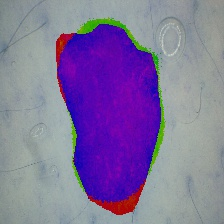
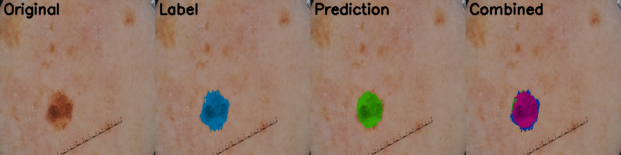
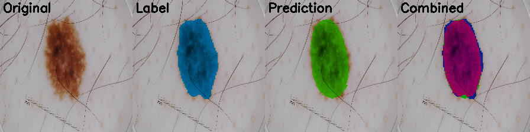
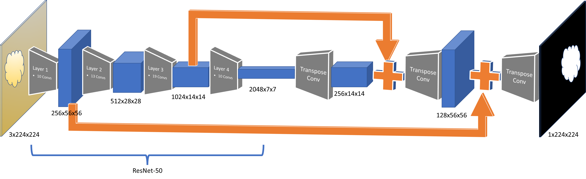
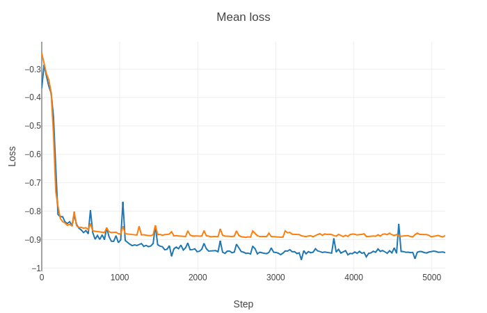
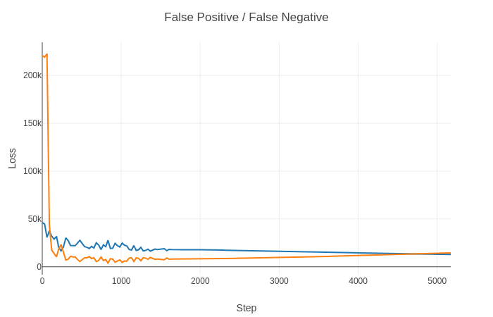
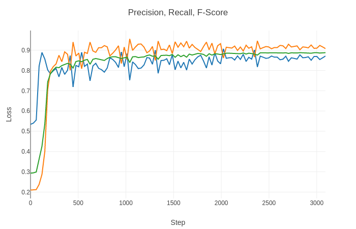

# isic-2018
There are 3 parts to the ISIC 2018 challenge:
Task 1: Lesion Boundary Segmentation
Task 2: Lesion Attribute Detection
Task 3: Disease Classification

# Task 1: Lesion Boundary Segmentation

A ResNet50 based FCN network was used to segment the lesion from other skin areas. An off-the-shelf imagenet trained ResNet50 model was outfitted with upsampling layers, skip connections and trained with weighted loss functions to achive fscores of 0.89.

## Sample Results

In the combined image:
- **Purple**: True Positive (model prediction matches lesion area marked by human)
- **Blue**: False Negative (model missed part of lesion in the area)
- **Green**: False Positive (model incorrectly predicted lesion in an area where there is none)





## Neural Net Architecture
ResNet-50 is a deep network with batch norms and identity shortcut connections that let gradients propogate well during backward propogation. 2D transpose convolutions up-sample tensors back to the original image's dimensions. A sigmoid layer generates 0/1 monochromatic image mask, where pixels corresponding to positive predictions are 1, the rest are 0. To improve precision, higher resolution tensor output from lower layers in ResNet are concatenated with input to 2D transpose convolution layers. This results in preditctions with finer details.

### Model




### Loss Functions and Metrics
During training the following metrics are computed after every 30 batches of training.

- IOU (Intersection over union) / [Jaccard index](https://en.wikipedia.org/wiki/Jaccard_index)
```python
def iou(y_true, y_pred):
    intersection = torch.sum(y_true * y_pred)
    return (intersection + 1.) / 
                (torch.sum(y_true) + torch.sum(y_pred) - intersection + 1.)
```

- [Dice Coefficient](https://en.wikipedia.org/wiki/S%C3%B8rensen%E2%80%93Dice_coefficient)
```python
def dice_coef(y_true, y_pred):
    intersection = torch.sum(y_true * y_pred)
    return (2. * intersection + 1.) / 
                (torch.sum(y_true) + torch.sum(y_pred) + 1.)
```

- [False Positive and False Negative]
```python
def falsepos(y_true, y_pred):
    intersection = torch.sum(y_true * y_pred)
    return torch.sum(y_pred) - intersection

def falseneg(y_true, y_pred):
    intersection = torch.sum(y_true * y_pred)
    return torch.sum(y_true) - intersection
```

- [Precision and Recall](https://en.wikipedia.org/wiki/Precision_and_recall)
```python
def precision(y_true, y_pred):
    intersection = torch.sum(y_true * y_pred)
    return intersection / (torch.sum(y_pred) + 1.)

def recall(y_true, y_pred):
    intersection = torch.sum(y_true * y_pred)
    return intersection / (torch.sum(y_true) + 1.)
```

- [F1-score](https://en.wikipedia.org/wiki/F1_score)
```python
def fscore(y_true, y_pred):
    presci = precision(y_true, y_pred)
    rec = recall(y_true, y_pred)
    return 2*(presci * rec)/(presci + rec)
```

- Loss function: 
  - Adapt F1-score function, weighted to improve recall as the loss function.
  - Returns negative f1 score, since larger fscore is preferable and optimizer will push it towards a larger negative value.
```python
def weighted_fscore_loss(weight):
    def fscore_loss(y_true, y_pred):
        presci = precision(y_true, y_pred)
        rec = recall(y_true, y_pred)
        return -(1+weight)*(presci * rec) / (weight*presci + rec)
    return fscore_loss
```

### Training

**dataset.py:**
Data set is randomly split into training and validation sets - 80% training and 20% validation.

Batches of data are transformed with [``` torchvision.transforms ```](https://pytorch.org/docs/stable/torchvision/transforms.html):
- Converting into tensors
- Normalized to values between -1 and 1 with mean 0.5 and std. dev 0.5.

**train.py:**
Batches of training data are loaded intp the GPU for computing the forward pass and getting the output of the network, calculating losses by comparing with labeled data and updating gradients in the backward pass through the loss function.

``` python
for i, (inputs, labels) in enumerate(train_loader, 0):

    # map to gpu
    inputs, labels = inputs.cuda(), labels.cuda()

    # zero the parameter gradients
    optimizer.zero_grad()

    # forward + backward + optimize
    outputs = net(inputs)
    loss = criterion(outputs, labels)
    loss.backward()
    optimizer.step()
```

Since I chose not to resize the images, I could only fit 10 images per batch in the GPU.
Resizing to smaller dimensions would have allowed larger batch sizes at the expense of precision.

At about 10 epochs of training, validation and training losses plateaued.

**Optimizer and learning rate:**

Torch offeres several [optimization](https://pytorch.org/docs/stable/optim.html) strategies, I used the popular Adam optimizer as it tends to converge quickly.
Through trial and error, I arrived at a learning rate of 1e-5. Further, I used pytorch's learning rate scheduler [ReduceLROnPlateau](https://pytorch.org/docs/stable/optim.html#torch.optim.lr_scheduler.ReduceLROnPlateau) to automatically scale the learning rate when validation starts stagnating. But in testing 10 epochs, the learning rate was not reduced.

## Evaluation
Metrics from training are sent to [Visdom](https://github.com/facebookresearch/visdom) server for visualization.

### Mean Training and Validation Losses

- <span style="color:orange">Orange: Validation loss</span> 
- <span style="color:blue">Blue: Training loss</span> 

---

### IOU and Dice Coefficient improves with training

- <span style="color:orange">Orange: IOU</span>
- <span style="color:blue">Blue: Dice coefficient</span>

---

### False Positives and False Negatives drop

- <span style="color:orange">Orange: False negatives</span>
- <span style="color:blue">Blue: False positives</span>

---

### Precision, Recall and F1-Score improve with training

- <span style="color:orange">Orange: Recall</span>
- <span style="color:blue">Blue: Precision</span>
- <span style="color:green">Green: F1-score</span>

---
